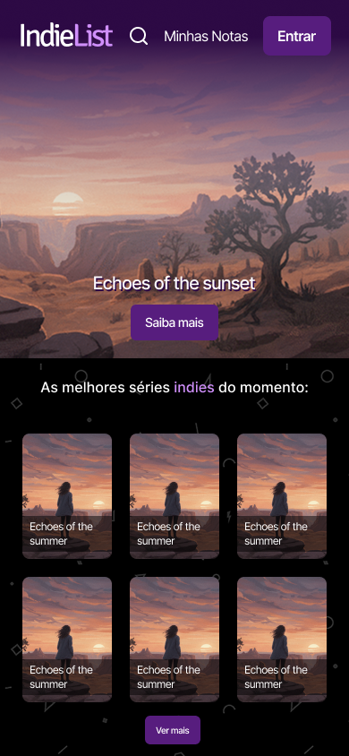
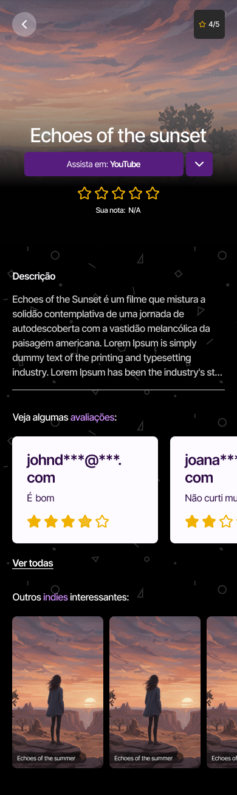
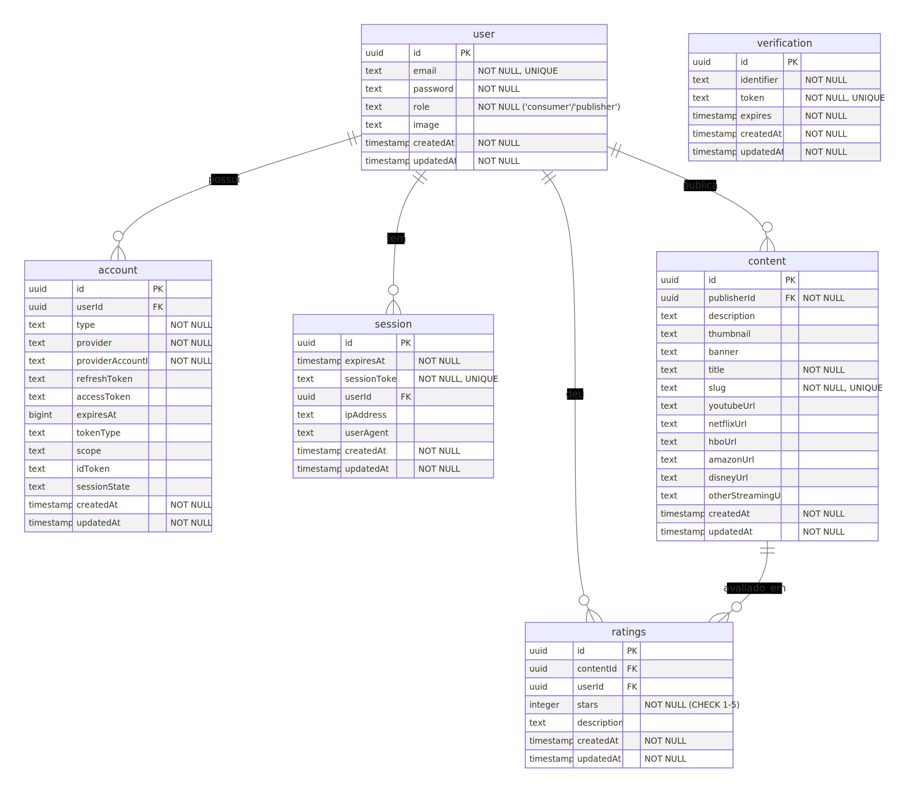

### <a name="readme-top">Indie List - Um projeto fullstack com back-end e front-end integrados no Next v16

Acesse o projeto em: [https://indie-list.frali.com.br/](https://indie-list.frali.com.br/)

Meu linkedIn e Figma do projeto abaixo (veja também a versão PDF do figma [aqui](docs/figma.pdf)):</a>


<!-- PROJECT SHIELDS -->
[![LinkedIn][linkedin-shield]](https://www.linkedin.com/in/fernandofrali/)
[![Figma][figma-shield]](https://www.figma.com/design/ATekGRJ9sfZWazYlUZxBTr/IndieList?node-id=5109-250&t=5AQxTCJakzKKtolt-1)

<!-- PROJECT LOGO -->
<br />
<div align="center">
  <a href="https://github.com/FernandoFrali/indie-list">
    
  </a>

<h3 align="center">Indie List</h3>

  <p align="center">
    Um site onde você pode avaliar ou publicar séries indies. Avalie e publique os melhores conteúdos!
    <br />
    <a href="https://indie-list.frali.com.br/api-docs"><strong>Veja a documentação da API</strong></a>
    <br />
  </p>
</div>

<!-- TABLE OF CONTENTS -->
<details>
  <summary>Tabela de conteúdos</summary>
  <ol>
    <li>
      <a href="#sobre-o-projeto">Sobre o projeto</a>
      <ul>
        <li><a href="#feito-com">Feito com</a></li>
      </ul>
    </li>
    <li>
      <a href="#primeiros-passos">Primeiros passos</a>
      <ul>
        <li><a href="#pré-requisitos">Pré-requisitos</a></li>
        <li><a href="#instalação">Instalação</a></li>
      </ul>
    </li>
    <li><a href="#roadmap">Roadmap</a></li>
    <li><a href="#contato">Contato</a></li>
  </ol>
</details>

<!-- ABOUT THE PROJECT -->

## Sobre o projeto

<table>
  <tr>
    <td valign="top"></td>
    <td></td>
  </tr>
</table>

<p align="right">(<a href="#readme-top">volte ao topo</a>)</p>

### Feito com

- [][next-url]
- [][react-url]
- [][typescript-url]
- [][sqlite-url]
- [][kysely-url]
- [][swagger-url]
- [][tailwind-url]
- [][biome-url]

### Deploy

Acesse em: https://indie-list.frali.com.br/

- [][nginx-url]
- [][pm2-url]

<p align="right">(<a href="#readme-top">volte ao topo</a>)</p>

### Diagrama do banco de dados | Modelo entidade relacionamento (ERD)



### Design System

Consulte o figma em: https://www.figma.com/design/ATekGRJ9sfZWazYlUZxBTr/IndieList?node-id=5109-250&t=5AQxTCJakzKKtolt-1


<!-- GETTING STARTED -->

## Primeiros passos

Para rodar o projeto, siga estas etapas:

### Pré-requisitos

- <details>
    <summary>NPM</summary>
    <ul>
      <li><a href="https://github.com/nvm-sh/nvm#installing-and-updating">Guia de instalação NVM</a></li>
    </ul>
  </details>

> **Nota**
>
> Não rode o projeto com BUN, pois a biblioteca better-sqlite3 não funciona devidamente com ele. Opte por yarn ou npm.
> </br>

### Instalação

1. Instale o NPM

2. Instale as dependências
   ```sh
   npm install
   ```
3. Prepare o ambiente. Olhe o arquivo `env.example` e copie o conteúdo para `.env`. OBS: atente-se ao <strong>caminho absoluto</strong> do DATABASE_URL até o arquivo sqlite. O arquivo SQLite tem que ficar em `db/db.sqlite`, exemplo: `DATABASE_URL=C:\Users\fernandofrali\Documents\projects\indie-list\db\db.sqlite`
4. Rode as migrations
   ```sh
   npm run migrate-up
   ```
5. Rode o kysely-codegen para ter a tipagem e poder buildar o projeto
   ```sh
   npm run migrate-up
   ```
6. Builde o projeto
   ```sh
   npm run build
   ```
7. Inicie o projeto
   ```sh
   npm start
   ```
8. (Opcional) Com o projeto rodando, execute o next-sitemap para ter o sitemap.xml
   ```sh
   npx next-sitemap
   ```
9. (Opcional, caso crie novas rotas) Rode o next-openapi-gen para ter a documentação da API atualizada
   ```sh
   npm run openapi
   ```

<!-- ROADMAP -->

## Roadmap

- [x] Criar documentação
- [ ] Adicionar testes
- [ ] Adicionar Bayesian Rating: `(v / (v + m)) * R + (m / (v + m)) * C`
- [ ] Cadastro facilitado sem senha
- [ ] Criar um admin para adição de categorias e controle de usuários/publicações
- [ ] Separação dos streamings em uma tabela separada controlada pelos admins
- [ ] Adicionar Typesense (Search Engine) para melhorar a busca quando tiver mais features. Atualmente a busca é altamente eficiente e rápida.
- [ ] Adicionar Storybook (UI component library) para melhorar a experiência de desenvolvimento ao escalar o projeto. Atualmente o projeto já tem um Figma definido com um design system, porém a longo prazo isso pode ser substituído pelo Storybook.

<p align="right">(<a href="#readme-top">volte ao topo</a>)</p>

<!-- CONTACT -->

## Contato

Linkedin - [in/FernandoFrali](https://www.linkedin.com/in/fernandofrali/)

Link do projeto: [https://github.com/FernandoFrali/indie-list](https://github.com/FernandoFrali/indie-list)

<p align="right">(<a href="#readme-top">volte ao topo</a>)</p>

<!-- MARKDOWN LINKS & IMAGES -->
<!-- https://www.markdownguide.org/basic-syntax/#reference-style-links -->

[contributors-shield]: https://img.shields.io/github/contributors/FernandoFrali/indie-list.svg?style=for-the-badge
[contributors-url]: https://github.com/FernandoFrali/indie-list/graphs/contributors
[forks-shield]: https://img.shields.io/github/forks/FernandoFrali/indie-list.svg?style=for-the-badge
[forks-url]: https://github.com/FernandoFrali/indie-list/network/members
[stars-shield]: https://img.shields.io/github/stars/FernandoFrali/indie-list.svg?style=for-the-badge
[stars-url]: https://github.com/FernandoFrali/indie-list/stargazers
[issues-shield]: https://img.shields.io/github/issues/FernandoFrali/indie-list.svg?style=for-the-badge
[issues-url]: https://github.com/FernandoFrali/indie-list/issues
[license-shield]: https://img.shields.io/github/license/FernandoFrali/indie-list.svg?style=for-the-badge
[license-url]: https://github.com/FernandoFrali/indie-list/blob/master/LICENSE.txt
[linkedin-shield]: https://img.shields.io/badge/-LinkedIn-black.svg?style=for-the-badge&logo=linkedin&colorB=555
[linkedin-url]: https://linkedin.com/in/FernandoFrali
[react-url]: https://reactjs.org/
[nginx-url]: https://nginx.org/
[pm2-url]: https://pm2.keymetrics.io/
[kysely-url]: https://kysely.dev/
[tailwind-url]: https://tailwindcss.com/
[sqlite-url]: https://sqlite.org/
[swagger-url]: https://swagger.io/
[next-url]: https://nextjs.org/
[biome-url]: https://biomejs.dev/pt-br/
[typescript-url]: https://www.typescriptlang.org/
[native-url]: https://reactnative.dev/
[node-url]: https://nodejs.org/
[mysql-url]: https://www.mysql.com/
[docker-url]: https://www.docker.com/
[figma-shield]: https://img.shields.io/badge/-Figma-black.svg?style=for-the-badge&logo=figma&colorB=white
